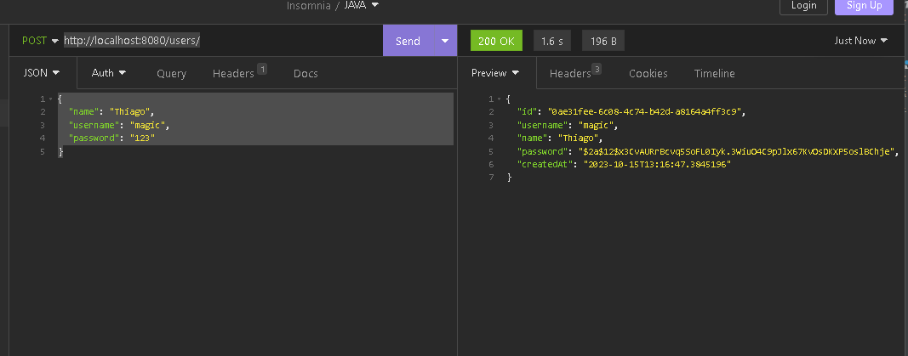

# Todo list api em Java com autenticação

Esse projeto é uma aplicação  de api  para a ferramenta Todo, onde é feito o cadastro do usuario e suas tarefas via api.

## 🚀 Começando

Faça  git clone  https://github.com/tsilva19/todolistjava.git

### 📋 Pré-requisitos

De que coisas você precisa para instalar o software e como instalá-lo?

```
maven
JAVA SDK 17
INSONMIA(Consumo da api)
```

### 🔧 Rodar o Projeto

Uma série de exemplos passo-a-passo que informam o que você deve executar para ter um ambiente de desenvolvimento em execução.

Rodar  a aplicação via terminal:

```
mvn springboot:run
```

E repita:

```
Até finalizar
```

Termine com um exemplo de como obter dados do sistema ou como usá-los para uma pequena demonstração.

## ⚙️ Executando os testes

Explicar como executar os testes automatizados para este sistema.

### 🔩 Entre no insonmia e faça a reqisição   do projeto 

#### Teste cadastro de usuario. post http://localhost:8080/users/

Entrada de dados 
```
{
	"name": "Thiago",
	"username": "magic",
	"password": "123"
}
```
Como usar exemplo na imagem:

* cadusuario


#### Teste cadastro de tarefa com autenticação. post http://localhost:8080/tasks/

Na aba auth do tipo basic  , informe usuário e senha 
* autenticação


Volte para o body  e preencha os dados de entrada
Entrada de dados
```
{
	"description": "Tarefa para gravar aula",
	"title": "Gravação de Aula ",
	"priority": "ALTA",
	"startAt": "2023-10-15T18:30:00",
	"endAt": "2023-10-15T21:30:00"
}
```
usar exemplo na imagem:

* cadastro de tarefa
  

#### Teste buscar tarefas com autenticação. GET http://localhost:8080/tasks/

Na aba auth do tipo basic  , informe usuário e senha
* autenticação


usar exemplo na imagem:

* buscar tarefa
  


#### Teste atualizar de tarefa com autenticação. put http://localhost:8080/tasks/{passar o id da task que quer atualizar}

Na aba auth do tipo basic  , informe usuário e senha
* autenticação


Volte para o body  e preencha os dados de entrada
Entrada de dados
```
{
	"title": "Gravação de Aula 2"
}

```
usar exemplo na imagem:

* autualiza tarefa
  
